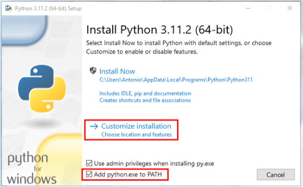
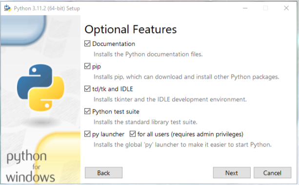

## P1 - Introduccion OpenCV

trabajamos en Windows

- Biblioteca OpenSource de visión por computador y aprendizaje automático
- Licencia BSD (permite uso y modificación de código)
	- +2500 algoritmos optimizados
    - Cásicos
    - Novedosos
    - Aprendizaje automático

- API - C++, Python, Java, Mathlab
- Soporte - Windows, Linux, Android, MacOS
- Optimización - MMX, SSE, CUDA, OpenCL

aplicaciones: herramientas 2D y 3D, estimacion movimiento , reconocimineto facial, gestos robotica, etc

## 1. Instalacion python

### Instalacion Python

- Python 3.12.2
- [https://www.python.org/downloads/](https://www.python.org/downloads/)





### Librerias necesarias

```bash 
py --version
	Python 3.12.2
```

Actualización de pip
```bash
python -m pip install --upgrade pip
```

Instalación de numpy
```bash
pip install numpy
```

Instalación de OpenCV
```bash
pip install opencv-contrib-python
```

Instalación de matplotlib
```bash
pip install matplotlib
```

## Ejercicios

Como primer contacto con OpenCV, vamos a plantear ejercicios basicos de manipulacion de imagenes y otros, para familialzarnos con las funciones de OpenCV

- Combinar canales, ordenar rgb con cv2.merge
- Conversion de color , seleccionar tono saturacion y valor con imshow
- variar tamaño imagenes, escalado imagenes con resize
- leer imagen basic con imread
- leer canal alfa, separar el color y alfa, resultado en blanco con imshow
- superposicion de imagenes con cvtColor, ver definicion de tamaño y alfa en ese ejercicio
- leer un video con cv2
- Abrir webCam definiendo con VideoCapture
- Separar canales rgb con imshow
- operaciones and or xor not con bitwise
- gestion del umbral con inrage, determinar que elementos de una matriz se encuentran en un determinado intervalo.

### Funciones
- merge
- imshow
- VideoCapture
- imread
- cvtColor
- split
- bitwise
- inRange


### Chroma
COn la webcam, realizar un chroma, reconoce el color verde
Idnetificar tono , aislar el color es facil, hay que definir un intervalo.