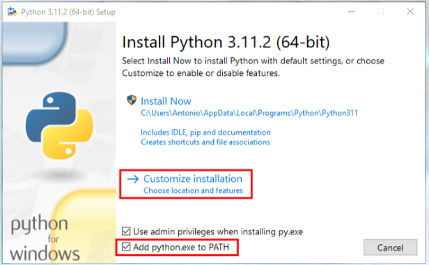
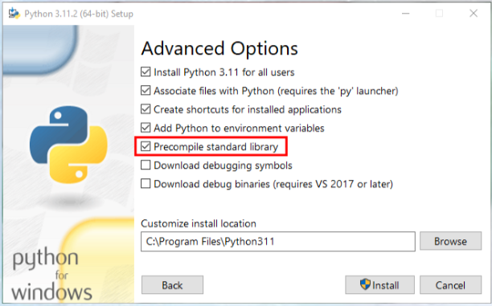
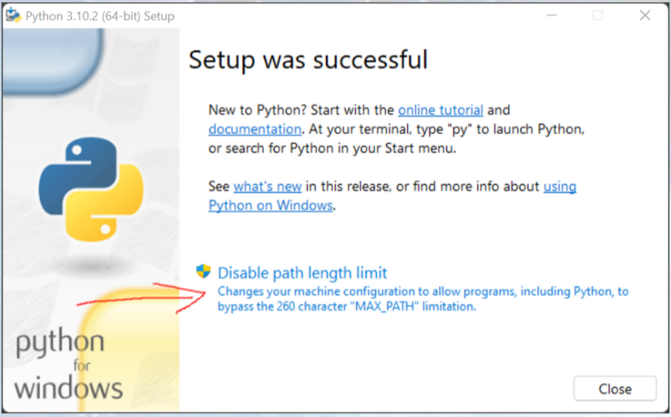

## P1 - Introduccion OpenCV

trabajamos en Windows

- Biblioteca OpenSource de visión por computador y aprendizaje automático
- Licencia BSD (permite uso y modificación de código)
	- +2500 algoritmos optimizados
    - Cásicos
    - Novedosos
    - Aprendizaje automático

- API - C++, Python, Java, Mathlab
- Soporte - Windows, Linux, Android, MacOS
- Optimización - MMX, SSE, CUDA, OpenCL

aplicaciones: herramientas 2D y 3D, estimacion movimiento , reconocimineto facial, gestos robotica, etc

## 1. Instalacion python

### Instalacion Python

- Python 3.12.2
- [https://www.python.org/downloads/](https://www.python.org/downloads/)






### Librerias necesarias

```bash 
py --version
	Python 3.12.2
```

Actualización de pip
```bash
python -m pip install --upgrade pip
```

Instalación de numpy
```bash
pip install numpy
```

Instalación de OpenCV
```bash
pip install opencv-contrib-python
```

Instalación de matplotlib
```bash
pip install matplotlib
```

## Ejercicios

### 1. Prueba
### 2. Lectura de imagen de fichero
### 3. usar imread + lectura de imagenes con canal alfa
### 4. lectura de un video 
